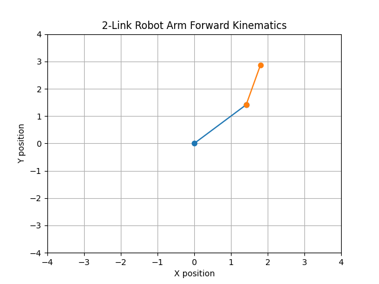

# Robot Arm Kinematics Simulator

This project demonstrates forward kinematics of a simple 2-link robotic arm.

The simulation calculates the end-effector position based on joint angles and link lengths.

## Concepts
- Forward kinematics
- Robot manipulators
- Joint angle transformations

## Output

## Tools
Python, NumPy, Matplotlib
